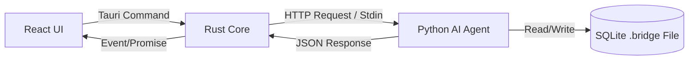

# 🚀 PROJECT KICK-OFF: BRIDGE RESEARCH APP
**Phiên bản:** 1.0.0 | **Ngày:** 17/01/2026
**Mục tiêu:** Xây dựng cầu nối tri thức giữa Nghiên cứu hàn lâm (Papers) và Triển khai thực tế (Engineering).

---

## 1. Vision & Mission
*   **Vision:** Không chỉ là một công cụ đọc báo (Reader), Bridge Research App là một **AI Research Assistant** giúp các kỹ sư và CTO trả lời câu hỏi: *"Công nghệ này áp dụng vào bài toán của công ty tôi như thế nào, tốn bao nhiêu nguồn lực, và rủi ro là gì?"*.
*   **Mission:** Tự động hóa quy trình Deep Research: Tìm kiếm -> Đọc hiểu -> Phân tích Code -> Đánh giá khả thi -> Đề xuất giải pháp.

---

## 2. Technical Architecture (Hybrid High-Performance)
Chúng ta sử dụng kiến trúc **Tauri + Python Sidecar** để tối ưu hóa hiệu năng (RAM/Disk) trong khi vẫn giữ sức mạnh xử lý AI của Python.

### 2.1. Tech Stack
*   **Frontend (UI):**
    *   **Framework:** React 19 + Vite + TypeScript.
    *   **Styling:** Tailwind CSS + Lucide Icons (Giữ vibe sạch sẽ của bản Legacy).
    *   **Visualization:** React Flow (để vẽ sơ đồ tư duy/cầu nối) hoặc Recharts (Trend Radar).
*   **Core App (System):**
    *   **Runtime:** **Tauri v2** (Rust).
    *   **Role:** Quản lý cửa sổ, File System (I/O), System Tray, bảo mật và khởi chạy Python Sidecar.
*   **AI Engine (Backend Sidecar):**
    *   **Language:** Python 3.11+.
    *   **Framework:** **FastAPI** (nhẹ, hỗ trợ async tốt).
    *   **Packaging:** **Nuitka** hoặc **PyInstaller** (Compile thành 1 file binary gọn nhẹ để bundle vào app).
    *   **AI Framework:** **DSPy** (ưu tiên cho quy trình suy luận/extraction có cấu trúc) hoặc **LangChain**.
*   **Database (Persistence):**
    *   **Type:** **SQLite** (Lưu trữ cục bộ).
    *   **Format:** `.bridge` file (Thực chất là SQLite file, người dùng có thể copy/backup/share dễ dàng).

### 2.2. Communication Flow

---

## 3. Scope of Work (Functional Requirements)

### 3.1. Phase 1: Foundation & Migration (Tái hiện Legacy)
*   **Search Engine:** Tìm kiếm Paper từ ArXiv (giữ logic cũ nhưng chuyển xử lý về Python để dễ mở rộng).
*   **Paper Reader:** Hiển thị Abstract, Metadata, Link PDF.
*   **Trend Radar:** Phân tích cụm chủ đề (Clustering) từ danh sách Paper đang load.
*   **Basic Chat:** Chat với Paper (RAG cơ bản: Abstract + Full Text).

### 3.2. Phase 2: The "Bridge" Intelligence (Core Value)
Đây là phần não bộ mới, xử lý bởi Python Agent:
*   **Deep Analyzer Agent:**
    *   Input: Paper PDF / URL.
    *   Output (Structured): Vấn đề giải quyết, Ý tưởng lõi (Novelty), Phương pháp (Methodology), Kết quả (Results), License.
*   **Feasibility Scorer:**
    *   Đánh giá độ phức tạp triển khai (Dựa trên phần cứng yêu cầu, độ khó thuật toán).
*   **Github Inspector:**
    *   Input: Link Github Repo (từ paper).
    *   Output: Tech stack (Ngôn ngữ, Framework), Dependencies chính, Hướng dẫn chạy (Detect `README.md` & `requirements.txt`).

### 3.3. Phase 3: Problem Solver & Search Expansion
*   **Multi-source Search:** Mở rộng tìm kiếm sang Google Search/DuckDuckGo (qua API hoặc scraping nhẹ) để tìm Tech Blog, Reddit discussion về paper đó.
*   **Solution Architect Agent:**
    *   User Input: "Tôi có bài toán X (ví dụ: OCR hóa đơn tiếng Việt), cần độ chính xác cao, chạy trên CPU."
    *   System Action:
        1.  Search Paper/Blog liên quan.
        2.  Filter các giải pháp chạy được trên CPU.
        3.  Suggest các repo Github phù hợp.
        4.  Tổng hợp thành báo cáo khuyến nghị.

### 3.4. Phase 4: Utilities & Polish
*   **Export/Report:** Xuất báo cáo Markdown/PDF chuẩn Latex.
*   **Data Management:** Import/Export `.bridge` file.
*   **Settings:** Quản lý API Keys (Gemini, OpenRouter), Local Model path (Ollama).

---

## 4. Data Strategy (Local-First)

Thay vì `localStorage` (không bền vững) hay Server DB (tốn chi phí), ta dùng **SQLite**.

**Schema dự kiến (Giản lược):**
*   `papers`: Chứa metadata, abstract, link, local_path (nếu đã tải).
*   `analyses`: Kết quả phân tích sâu của AI (JSON structure: feasibility, novelty, stack...).
*   `trends`: Các trend đã detect.
*   `chats`: Lịch sử chat.
*   `repos`: Thông tin phân tích từ Github.

File database sẽ có đuôi `.bridge`. Khi user mở app, họ có thể chọn "Open Project" và trỏ tới file này.

---

## 5. Research & Methodology (AI Approach)

Để đạt được khả năng "Suy 1 ra 2" như yêu cầu, chúng ta sẽ áp dụng các kỹ thuật sau trong Python Backend:

1.  **DSPy (Declarative Self-improving Language Programs):**
    *   Thay vì viết prompt thủ công (dễ lỗi), ta dùng DSPy để định nghĩa các `Signature` (Input -> Output).
    *   Ví dụ: `class PaperAnalyzer(dspy.Signature): input_text -> novelty, hardware_reqs, implementation_difficulty`.
    *   DSPy giúp output ra JSON cực chuẩn, tránh hallucination.
2.  **RAG (Retrieval-Augmented Generation):**
    *   Dùng **ChromaDB** (embedded mode) hoặc **BM25** (cho nhẹ) để index các paper đã lưu.
    *   Cho phép search ngữ nghĩa: "Tìm các paper nói về *attention mechanism* nhưng *không dùng Transformer*".
3.  **Chain-of-Thought (CoT):**
    *   Khi user hỏi về bài toán, Agent sẽ suy luận theo bước: Xác định bài toán -> Tìm keywords -> Search Paper -> Search Github -> Đối chiếu -> Kết luận.

---

## 6. Roadmap triển khai

*   **Sprint 1 (Setup):**
    *   Init Tauri v2 Project.
    *   Setup Python Environment & FastAPI.
    *   Config giao tiếp Tauri <-> Python.
*   **Sprint 2 (Migration):**
    *   Port UI React cũ sang.
    *   Viết API Search ArXiv bên Python.
    *   Kết nối UI với Python API.
*   **Sprint 3 (Deep Analysis):**
    *   Implement `PaperAnalyzer` module (DSPy).
    *   Implement Database SQLite.
*   **Sprint 4 (Bridge Features):**
    *   Implement Github Code Analysis.
    *   Implement Solution Suggester.

---

## 7. Out of Scope (Những thứ KHÔNG làm)
*   **User Auth:** Mọi thứ nằm trên máy user.
*   **Cloud Sync:** User tự sync file `.bridge` qua Google Drive/Dropbox nếu muốn.
*   **Full Code Generation:** Chỉ phân tích code có sẵn, không cố gắng viết code mới hoàn toàn (để tránh cạnh tranh với Cursor/Windsurf).